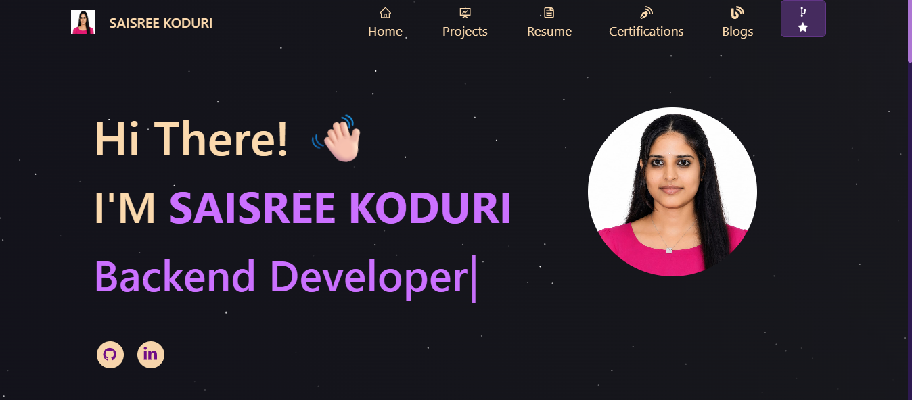

# SAISREE KODURI | Portfolio Website



## 🚀 Live Portfolio

Coming Soon on Vercel

---

## 📌 About This Project

This is my personal portfolio website developed using React.js.  
It showcases my:

- Projects
- Technical Skills
- Certifications
- Resume
- Full Stack Development Experience

The portfolio is designed with a modern responsive UI and smooth animations.

---

## 🛠️ Technologies Used

- React.js
- JavaScript
- HTML5
- CSS3
- Bootstrap
- React Icons
- React Reveal

---

## 💼 Featured Projects

### 🔹 Sales & Order Management System
MERN stack application for sales tracking, inventory management, customer billing, and order handling.

### 🔹 Inventory Management System
Warehouse inventory and stock management application with product tracking features.

### 🔹 Invoice Generator
Python automation project for generating invoices and billing reports automatically.

### 🔹 POS Label Automation
Python-based automation system for generating POS labels efficiently.

### 🔹 Interactive Age Calculator
Responsive JavaScript web application that calculates exact age dynamically.

### 🔹 Personal Portfolio
Modern React portfolio website showcasing projects, skills, and certifications.

---

## 📂 Project Setup

Clone the repository:

```bash
git clone https://github.com/sreekoduri/Saisree-s_Folio.git
```

Go to project folder:

```bash
cd Saisree-s_Folio
```

Install dependencies:

```bash
npm install
```

Start development server:

```bash
npm start
```

---

## 📦 Build for Production

```bash
npm run build
```

---

## 🌐 Deployment

This portfolio can be deployed easily using:

- Vercel
- Netlify
- GitHub Pages

---

## 📧 Contact

### SAISREE KODURI

- GitHub: https://github.com/sreekoduri
- LinkedIn: Add Your LinkedIn Link
- Email: Add Your Email

---

## ⭐ Thank You

Thank you for visiting my portfolio repository.